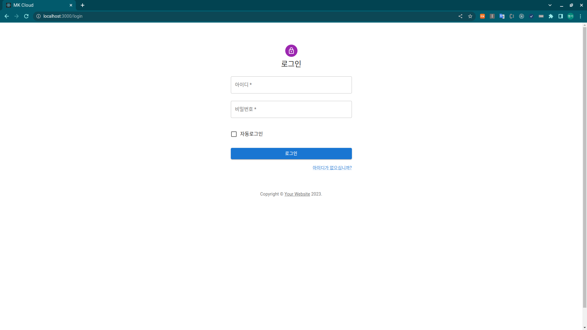

# MKCloud

     

## Introduction
UX에 특화된 사용하기 편리한 클라우드 서비스

회원가입하면 기본적으로 10GB의 저장 공간을 가진다.

회원가입 남용을 방지하기 위해 관리자의 승인이 있어야 서비스를 이용할 수 있다.

## Feature

- 자동 로그인 기간이 길다.

- 원클릭 다운로드, 삭제, 업로드

## Architecture

## Contributer

- [wonjinYi](https://github.com/wonjinYi)

## Demo

메인화면

업로드화면

로그인화면

